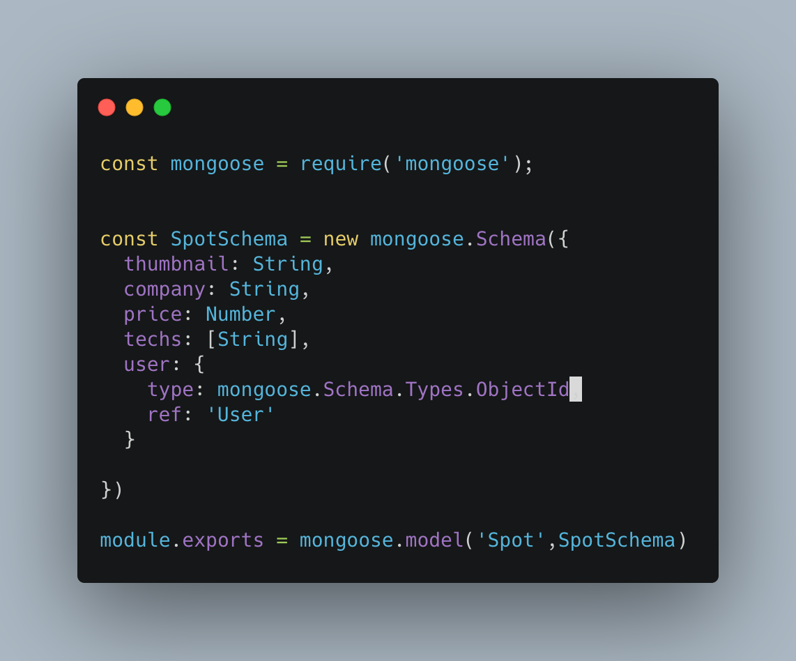
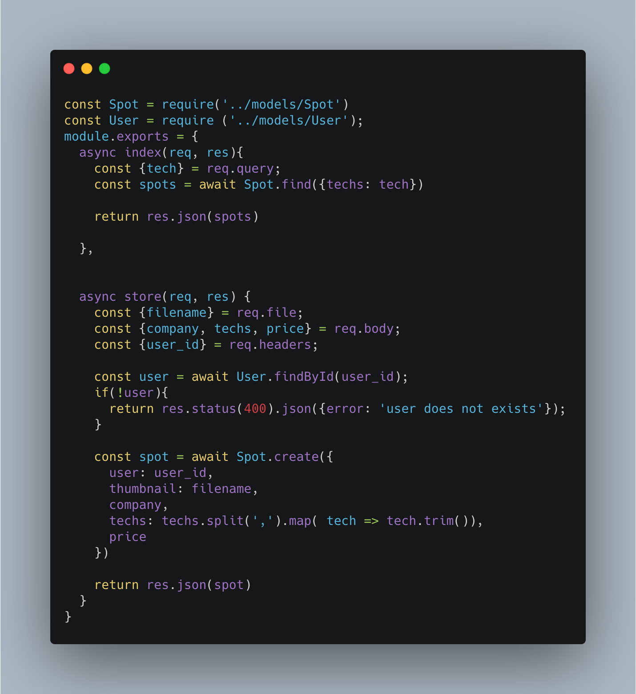
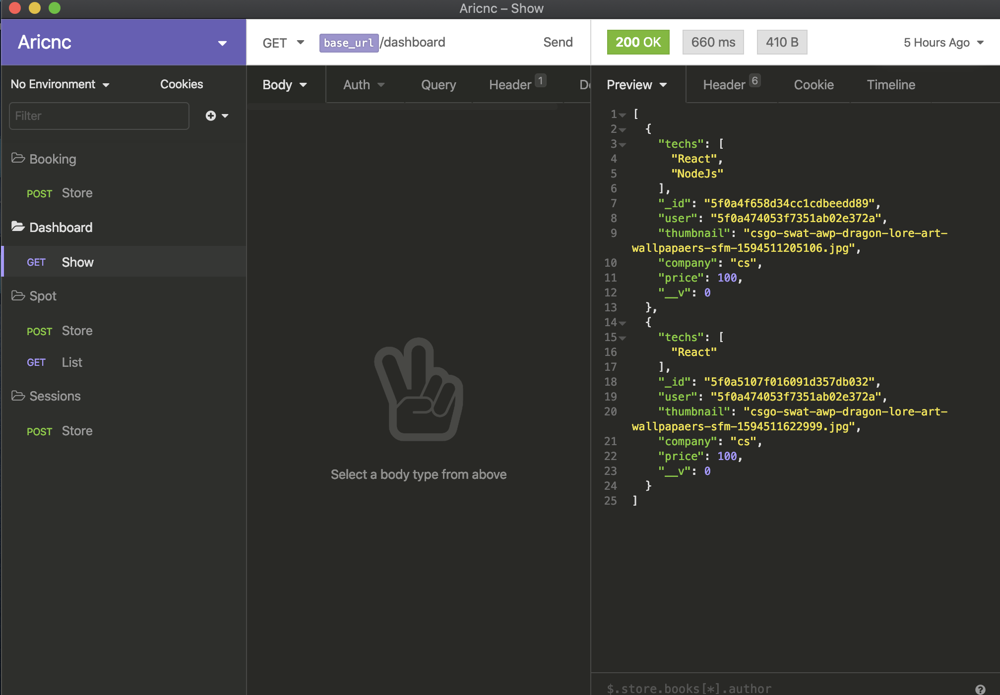
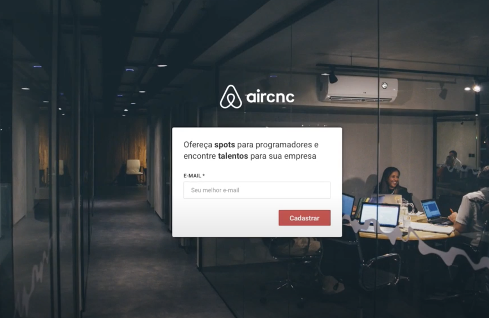
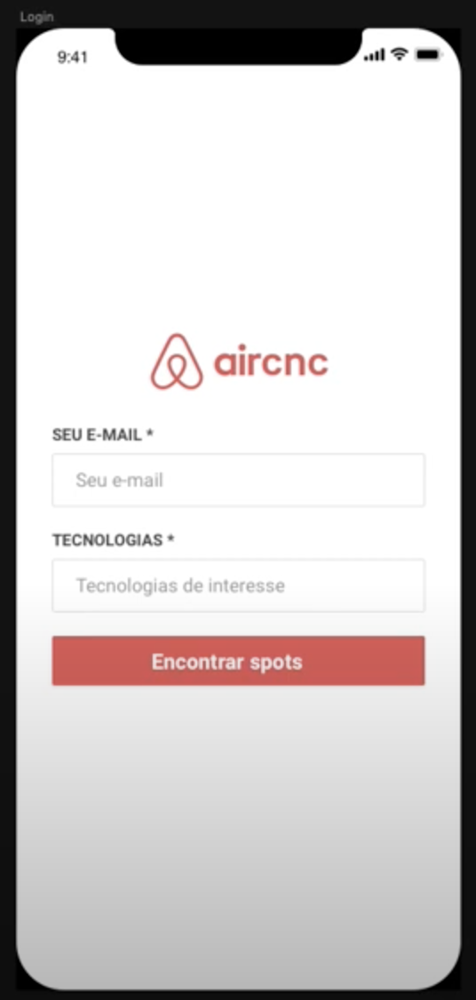

  

I started this application for developing my skills in javaScript with some frameworks Node Js, React & React Native. this application has the objective to help companies to provide spots for students and devs.

## Backend

The backend was developed on the js node with some dependencies.

  

  

### Commands

  - "yarn" for install all dependencies
  - "yarn dev" to start the project

## Insomnia

Enter in the folder and execute the command "npx serve" to see the documentation.

  

#### Dependencies
  * Express
  * Mongoose
  * Multer
  * Cors

## Frontend

  

#### Dependencies
  * React
  * react-router-dom
  * Axios

### Commands

  - "yarn" for install all dependencies
  - "yarn start" to start the project

## Mobile

  

#### Dependencies

